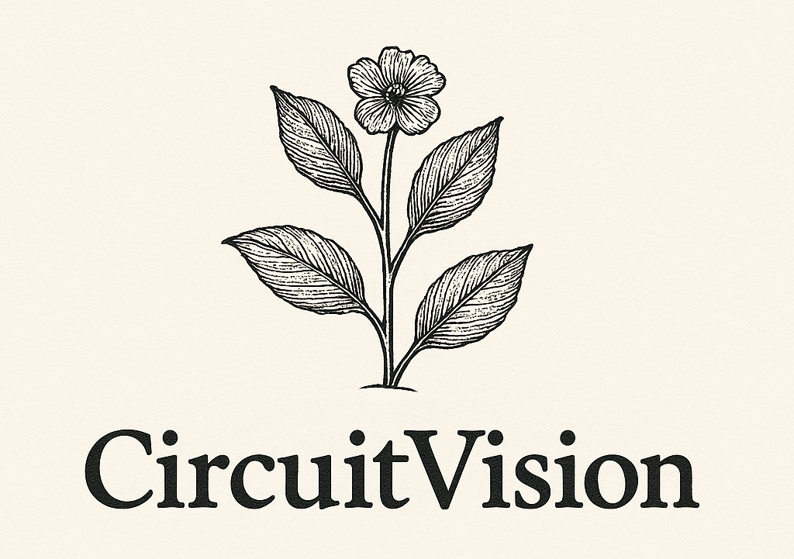

# CircuitVision: AI-Powered Electrical Circuit Analysis & Netlist Generation

<p align="center">
  
</p>

<p align="center">
  <a href="https://app.jawadk.me/circuits/" target="_blank">
    
  </a>
  <a href="https://github.com/JKc66/SDP_demo/blob/main/LICENSE" target="_blank">
  
  </a>  

  <a href="https://github.com/JKc66/SDP_demo/issues">
    
  </a>
</p>
<p align="center">
  <a href="https://github.com/mah-sam">
    
  </a>
  <a href="https://github.com/JKc66">
    
  </a>
</p>

## 📚 Table of Contents
- [🚀 Overview](#-overview)
- [✨ Key Features & The Engineering Behind Them](#-key-features--the-engineering-behind-them)
  - [👁️ Advanced Component Detection (Fine-Tuned YOLOv11)](#️-advanced-component-detection-fine-tuned-yolov11)
  - [📐 Precise Circuit Segmentation & Intelligent Cropping (Adapted SAM 2)](#-precise-circuit-segmentation--intelligent-cropping-adapted-sam-2)
  - [🔗 Custom-Developed Node & Connection Analysis](#-custom-developed-node--connection-analysis)
  - [📝 Automated & Enriched Netlist Generation](#-automated--enriched-netlist-generation)
  - [🖥️ Intuitive User Interface & Rich Visualization](#️-intuitive-user-interface--rich-visualization)
- [📈 Our Development Journey & Enhancements](#-our-development-journey--enhancements)
- [🛠️ Setup](#️-setup)
  - [🐳 Using Docker (Recommended)](#-using-docker-recommended)
- [🚀 Usage](#-usage)

## 🚀 Overview

CircuitVision is an innovative application designed to bridge the gap between visual **electrical circuit** diagrams and functional simulations. It intelligently analyzes images of **electrical circuits**—whether hand-drawn, photographed, or from schematics—and transforms them into SPICE-compatible netlists, providing an easy access to the operating point parameters of the circuit. This project leverages a sophisticated pipeline of **fine-tuned and custom-adapted AI models**, including **YOLOv11** for component detection, an **adapted SAM 2 (Segment Anything Model 2)** for precise segmentation and intelligent cropping, and **Google's Gemini** for its robust OCR ability.

Our goal is to automate the tedious process of manual circuit transcription, enabling engineers, students, and hobbyists to quickly digitize, understand, and simulate **electrical circuits** with unprecedented ease and accuracy.

## ✨ Key Features & The Engineering Behind Them

### 👁️ Advanced Component Detection (Fine-Tuned YOLOv11)
* Utilizes a **YOLOv11 model fine-tuned specifically on electrical circuit component datasets**. This training enables robust identification of diverse **electrical components** even in complex or noisy images.
* Employs Non-Maximum Suppression (NMS) based on confidence scores to eliminate redundant detections, ensuring a clean and precise component map.
* Bounding boxes are re-calculated and validated post-SAM2 cropping to maintain accuracy on the precisely segmented region of interest.

### 📐 Precise Circuit Segmentation & Intelligent Cropping (Adapted SAM 2)
* Integrates an **adapted Segment Anything Model 2 (SAM 2)**. We've tailored its application to achieve highly detailed segmentation, accurately isolating the primary **circuit diagram area** from its background.
* The input image and the SAM 2 binary mask are intelligently cropped based on the segmented circuit's extent (with optimal padding). This crucial step focuses all subsequent analyses (node detection, value extraction) solely on the relevant circuit area, significantly boosting performance and reducing noise.
* In scenarios where SAM 2 processing is unavailable or disabled, the system gracefully defaults to analyzing the original, uncropped image.

### 🔗 Custom-Developed Node & Connection Analysis
* Our **custom-developed node connection algorithm** leverages the SAM 2-generated binary mask (after excluding component areas) and the adjusted YOLO bounding boxes. This allows for superior precision in identifying conductive traces and connection nodes within the **electrical circuit**.
* Features a **newly implemented pixel-based corner finding algorithm**, replacing previous methods for enhanced robustness and accuracy across diverse circuit image styles and qualities. Includes comprehensive fallback mechanisms and empty coordinate checks.

### 📝 Automated & Enriched Netlist Generation
* **Two-Stage Intelligent Process:**
    1.  **Structural Netlist:** An initial "valueless" netlist is generated based on the detected components (from fine-tuned YOLO) and their geometric interconnections (from custom node analysis).
    2.  **Gemini-Powered Value & Type Enrichment:** An enumerated image, clearly marking each detected component with a unique ID, is passed to the **Gemini Pro Vision model**. Gemini then performs advanced OCR and contextual understanding to accurately identify component types (Resistors, Capacitors, Voltage/Current Sources, etc.) and extract their corresponding values (e.g., 10kΩ, 100µF, 12V). This step also serves as a cross-validation for component types initially detected by YOLO.
* **SPICE-Ready Output:** The final netlist is meticulously filtered to remove invalid or incomplete entries, ensuring a clean, reliable, and simulation-ready output for SPICE-based tools.

### 🖥️ Intuitive User Interface & Rich Visualization
* **Streamlined Workflow:** Analysis is automatically triggered upon image upload, with a custom loading animation providing real-time feedback.
* **Comprehensive Results Dashboard:**
    *   Visualize each critical step: annotated component detections (YOLO), SAM 2 segmentation masks, identified node connections.
    *   Detailed performance timings for each major analysis stage (YOLO, SAM 2, Cropping, Node Analysis, Netlist Generation).
    *   Display of original image properties and extracted EXIF data for traceability.
* **Intelligent Preprocessing:** Images are automatically rotated based on EXIF orientation data before any analysis begins.
* **Debugging & Transparency:** Dedicated expander sections reveal intermediate debug images, including the enumerated image sent to Gemini, providing insight into the AI's "reasoning."

## 📈 Our Development Journey & Enhancements
CircuitVision is the culmination of significant research and development in applying and adapting cutting-edge AI to the specialized domain of **electrical circuit analysis**. We've moved beyond off-the-shelf model usage to:
*   **Model Fine-Tuning:** Extensive work was done to **fine-tune YOLOv11** on specific **electrical circuit datasets** to maximize component recognition accuracy.
*   **SAM 2 Adaptation:** We've **custom-adapted the application of SAM 2** for optimal circuit segmentation, leading to the intelligent cropping feature which is key to downstream accuracy.
*   **Algorithm Development:** The node analysis and corner detection algorithms are **custom-built** for the unique challenges of **electrical circuit diagrams**.
*   **Multi-Model Orchestration:** Integrating YOLO, SAM 2, and Gemini into a cohesive and efficient pipeline represents a complex engineering achievement.

For a detailed history of changes, technical deep-dives, and specific commit references, please refer to our **[CHANGELOG.md](./CHANGELOG.md)**.

## 🛠️ Setup

1.  **Models & API Access:**
    *   **YOLO & SAM 2 Models:** Our system relies on specific pre-trained and fine-tuned model weights.
        Run the provided script to download the necessary model files:
        ```bash
        python download_models.py
        ```
        This will create `models/YOLO` and `models/SAM2` directories and populate them. Ensure you have `requests` and `gdown` installed (`pip install requests gdown`).
    *   **Gemini API Key:** You will need a Google Gemini API key. Set it as an environment variable `GEMINI_API_KEY` or configure it within the application as required.

2.  **Dependencies:** Install all required Python packages:
    ```bash
    pip install -r requirements.txt
    ```

3.  **Configuration:** Review `config.py` (or relevant configuration files) for any paths or settings that might need adjustment for your environment, though defaults should work if models are downloaded as per step 1.

### 🐳 Using Docker (Recommended)

For a consistent and isolated environment, we recommend using Docker.

1.  **Build the Docker Image:**
    From the project root directory (containing the `Dockerfile`):
    ```bash
    docker build -t circuitvision .
    ```

2.  **Run with Docker Compose (if `docker-compose.yml` is provided):**
    This is often the simplest way to manage multi-container applications or complex setups.
    ```bash
    docker-compose up --build
    ```
    To run in detached mode:
    ```bash
    docker-compose up -d --build
    ```
    *(Ensure your `GEMINI_API_KEY` is available to the Docker environment, e.g., via an `.env` file used by Docker Compose or by passing it as an environment variable in the `docker-compose.yml`)*

3.  **Run the Docker Container Manually:**
    ```bash
    docker run -p 8501:8501 \
               -v ./models:/app/models \
               -e GEMINI_API_KEY="YOUR_API_KEY" \
               circuitvision
    ```
    *Adjust port mappings, volume mounts (`-v`), and environment variables (`-e`) as needed.*
    *The `download_models.py` script can also be run inside the Docker container if models are not mounted from the host.*

## 🚀 Usage

1.  **Launch Application:** Start the CircuitVision Streamlit app (e.g., `streamlit run app.py` or via Docker).
2.  **Upload Image:** Use the file uploader to select an image of the **electrical circuit** you wish to analyze.
3.  **Automatic Analysis:** The system will automatically:
    *   Pre-process the image (EXIF rotation).
    *   Perform component detection (YOLO).
    *   Segment and crop the circuit (SAM 2).
    *   Execute custom node analysis.
    *   Generate the initial structural netlist.
    *   Query Gemini for component values and types.
    *   Produce the final, enriched netlist.
4.  **Review Results:** Explore the visualizations, component statistics, timing data, and the generated netlists directly in the UI.
5.  **Simulate:** Copy the final netlist for use in your preferred SPICE simulation software.

---

We are passionate about making complex **electrical circuit analysis** accessible and efficient. We hope CircuitVision empowers your projects!
